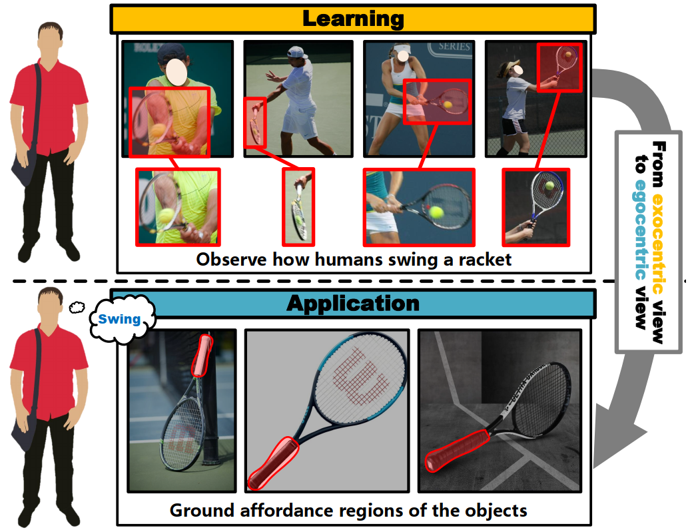
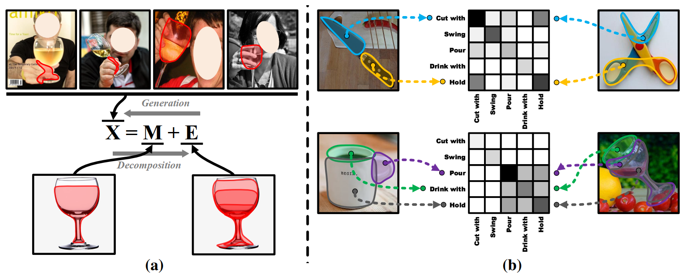
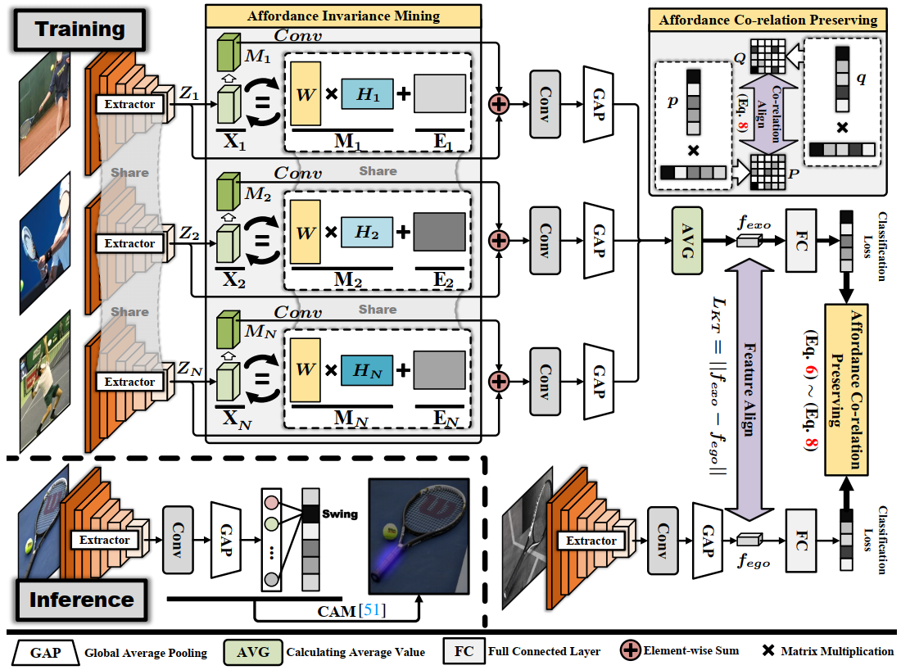
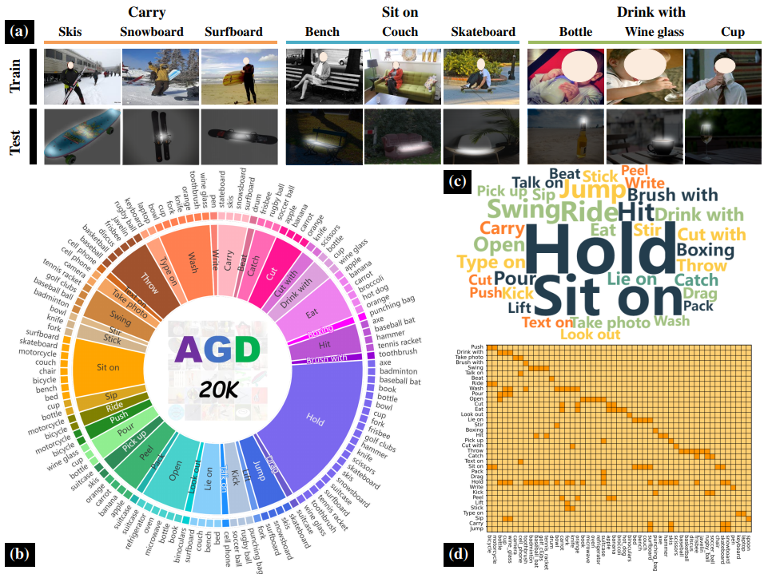
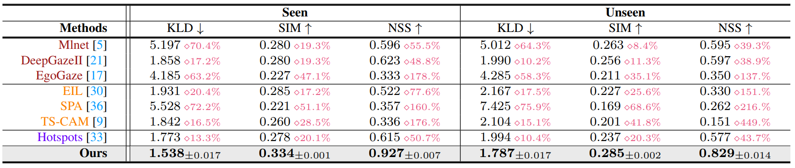
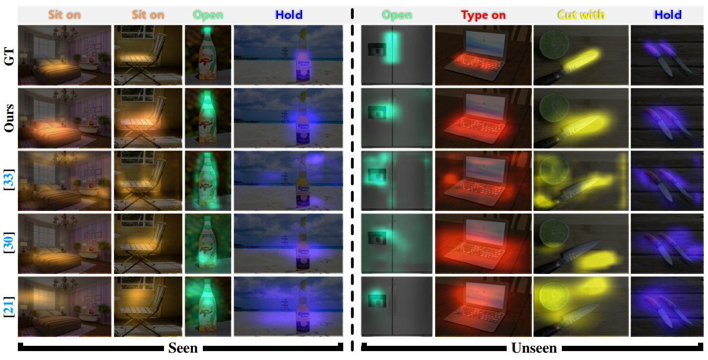

# Learning Affordance Grounding from Exocentric Images
PyTorch implementation of our Cross-view-AG models. This repository contains PyTorch evaluation code, training code.
1. [📎 Paper Link](#1)
2. [💡 Abstract](#2)
3. [📖 Method](#3)
4. [📂 Dataset](#4)
5. [📊 Experimental Results](#7)
6. [✉️ Statement](#8)
7. [✨ Other Relevant Works](#9)
8. [🔍 Citation](#10)

## 📎 Paper Link <a name="1"></a> 
* Learning Affordance Grounding from Exocentric Images (CVPR2022) [[pdf](https://arxiv.org/abs/2203.09905)] [[Supplementary Material](https://drive.google.com/file/d/1VN27W_srlKpsYczqO-4mS0X6-qsHTi4j/view?usp=sharing)]
> Authors:
> Hongchen Luo, Wei Zhai, Jing Zhang, Yang Cao, Dacheng Tao
* Grounded Affordance from Exocentric View (Extended version) [[pdf]()]
> Authors:
> Hongchen Luo, Wei Zhai, Jing Zhang, Yang Cao, Dacheng Tao

## 💡 Abstract <a name="2"></a> 
Affordance grounding, a task to ground (i.e., localize) action possibility region in objects, which faces the challenge of establishing an explicit link with object parts due to the diversity of interactive affordance. Human has the ability that transform the various exocentric interactions to invariant egocentric affordance so as to counter the impact of interactive diversity. To empower an agent with such an ability, this paper proposes a task of affordance grounding from exocentric view, i.e., given exocentric human-object interaction and egocentric object images, learning the affordance knowledge of the object and transferring it to the egocentric image using only the affordance label as supervision. To this end, we devise a cross-view knowledge transfer framework that extracts affordance-specific features from exocentric interactions and enhances the perception of affordance regions by preserving affordance correlation. Specifically, an Affordance Invariance Mining module is devised to extract specific clues by minimizing the intra-class differences originated from interaction habits in exocentric images. Furthermore, an Affordnace Co-relation Preserving strategy is presented to perceive and localize affordance by aligning the co-relation matrix of predicted results between the two views. Particularly, an affordance grounding dataset named AGD20K is constructed by collecting and labeling over 20K images from 36 affordance categories. Experimental results demonstrate that our method outperforms the representative methods in terms of objective metrics and visual quality.

<p align="center">
     <br />
    <em> 
    </em>
</p>

**Observation.** By observing the exocentric diverse interactions, the human learns affordance knowledge determined by the object’s intrinsic properties and transfer it to the egocentric view.

<p align="center">
     <br />
    <em> 
    </em>
</p>

**Motivation.** (a) Exocentric interactions can be decomposed into affordance-specific features M and differences in individual habits E. (b) There are co-relations between affordances, e.g.“Cut with” inevitably accompanies “Hold” and is independent of the object category (knife and scissors). Such co-relation is common between objects. In this paper, we mainly consider extracting affordance-specific cues M from diverse interactions while preserving the affordance co-relations to enhance the perceptual capability of the network.


## 📖 Method <a name="3"></a> 

<p align="center">
     <br />
    <em> 
    </em>
</p>

**Overview of the proposed cross-view knowledge transfer affordance grounding framework.** It mainly consists of an Affordance Invariance Mining (AIM) module and an Affordance Co-relation Preservation (ACP) strategy. The AIM module (see in Sec. 3.1) aims to obtain invariant affordance representations from diverse exocentric interactions. The ACP strategy (see in Sec. 3.2) enhances the network’s affordance perception by aligning the co-relation of the outputs of the two views.

## 📂 Dataset <a name="4"></a> 

<p align="center">
     <br />
    <em> 
    </em>
</p>

**The properties of the AGD20K dataset.** (a) Some examples from the dataset. (b) The distribution of categories in AGD20K. (c) The word cloud distribution of affordances in AGD20K. (d) Confusion matrix between the affordance category and the object category in AGD20K, where the horizontal axis denotes the object category and the vertical axis denotes the affordance category.

## 📊 Experimental Results <a name="7"></a> 

<p align="center">
     <br />
    <em> 
    </em>
</p>

**The results of different methods on AGD20k.** The best results are in bold. “Seen” means that the training set and the test set contain the same object categories, while “Unseen” means that the object categories in the training set and the test set do not overlap. The * defines the relative improvement of our method over other methods. “Dark red”, “Orange” and “Purple” represent saliency detection, weakly supervised object localization and affordance grounding models, respectively.

<p align="center">
     <br />
    <em> 
    </em>
</p>


**Visual affordance heatmaps on the AGD20K dataset.** We select the prediction results of representative methods of affordance grounding (Hotspots [33]), weakly supervised object localization (EIL [30]), and saliency detection (DeepGazeII [21]) for presentation.

## ✉️ Statement <a name="8"></a> 
This project is for research purpose only, please contact us for the licence of commercial use. For any other questions please contact [lhc12@mail.ustc.edu.cn](lhc12@mail.ustc.edu.cn) or [wzhai056@mail.ustc.edu.cn](wzhai056@mail.ustc.edu.cn).

## ✨ Other Relevant Works <a name="9"></a> 

1.The paper "One-Shot Affordance Detection" was accepted by IJCAI2021 and the corresponding paper and code are available from [https://github.com/lhc1224/OSAD_Net](https://github.com/lhc1224/OSAD_Net).

2.The paper "Phrase-Based Affordance Detection via Cyclic Bilateral Interaction" was accepted by IEEE Transactions on Artificial Intelligence (T-AI). The language-annotated PAD-L dataset is available for download via [ [link](https://arxiv.org/abs/2202.12076) ], and related papers and code can be downloaded from the [[link](https://github.com/lulsheng/CBCE-Net)].

3.The paper "Grounding 3D Object Affordance from 2D Interactions in Images" and the corresponding code are obtained from [https://github.com/yyvhang/IAGNet](https://github.com/yyvhang/IAGNet).


## 🔍 Citation <a name="9"></a> 

```
@inproceedings{Learningluo,
  title={Learning Affordance Grounding from Exocentric Images},
  author={Luo, Hongchen and Zhai, Wei and Zhang, Jing and Cao, Yang and Tao, Dacheng},
  booktitle={CVPR},
  year={2022}
}
```
